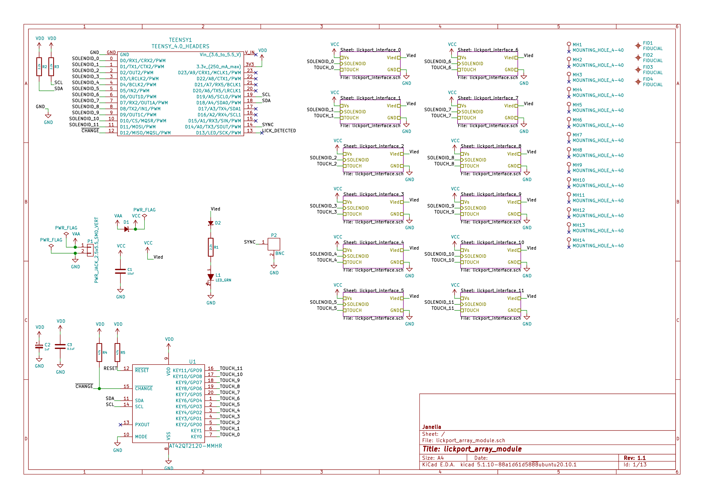
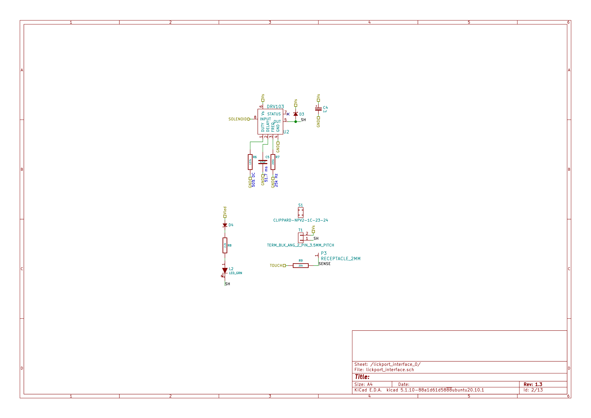
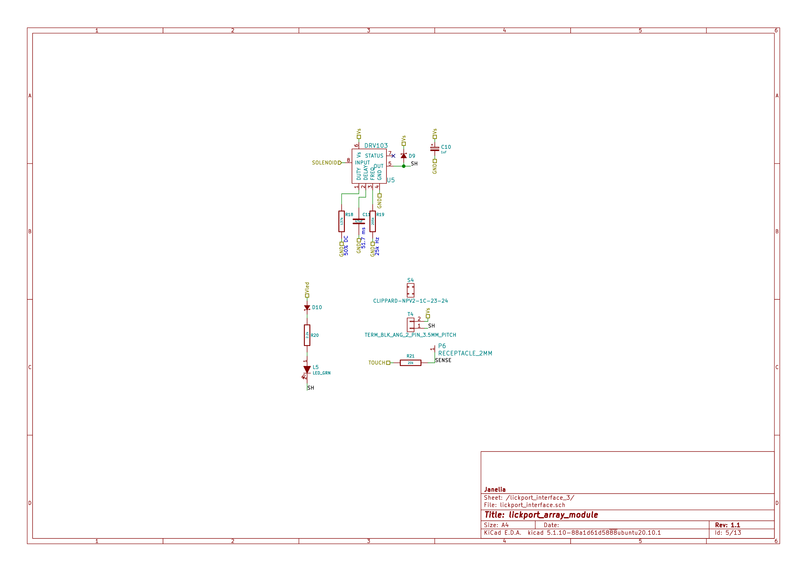
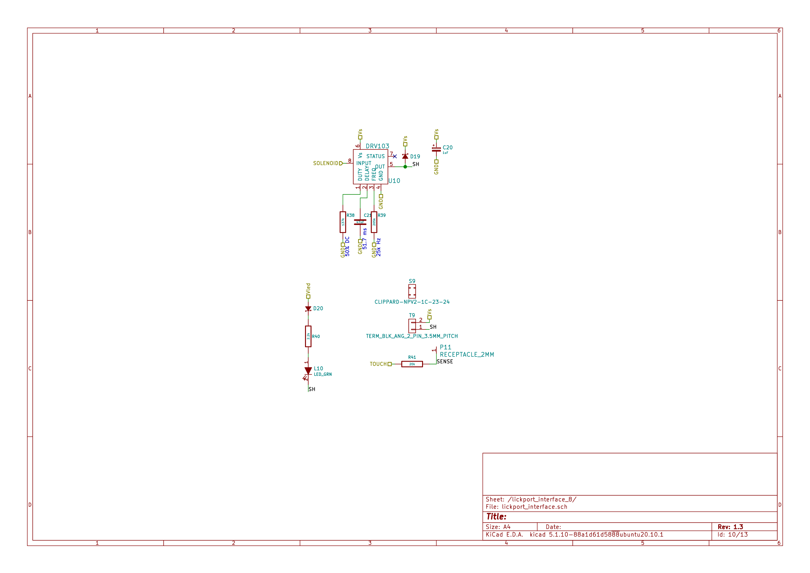
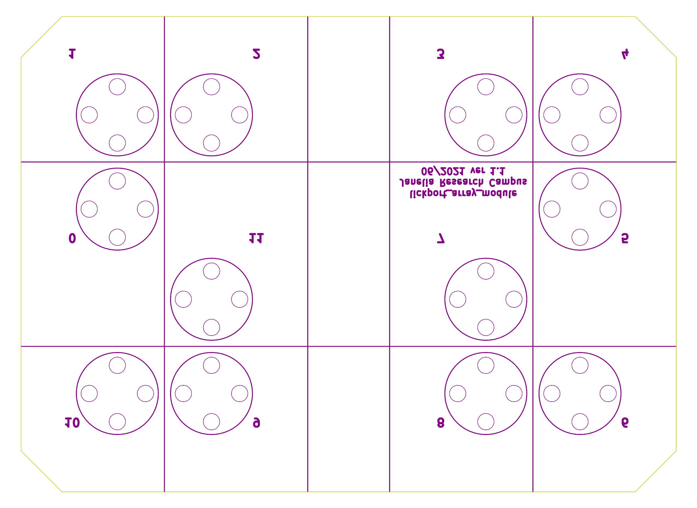
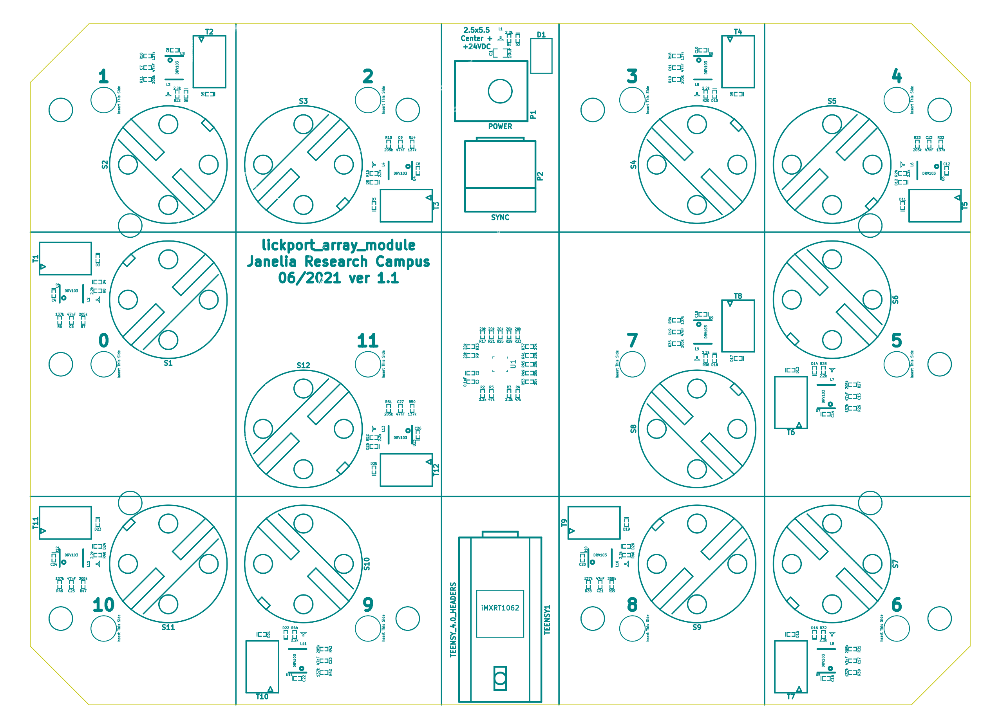

# Table of Contents

1.  [Repository Information](#orga8e6517)
    1.  [Description](#orge0a1ef8)
2.  [Images](#org47b3031)
3.  [Schematic](#org74bce24)
4.  [Gerbers](#orgda319f5)
5.  [Bill of Materials](#org7cec3ef)
    1.  [PCB Parts](#orgf75ec50)
    2.  [Supplemental Parts](#org1bfa03e)
    3.  [Vendor Parts Lists](#org62311e5)
6.  [Supplemental Documentation](#org4320edf)
    1.  [Assembly Instructions](#org2aa6f94)
7.  [Manufacturing Archive](#org0e849f4)

# Repository Information

-   **Name:** lickport\_array\_module
-   **Version:** 1.0
-   **License:** Open-Source Hardware
-   **URL:** <https://github.com/janelia-kicad/lickport_array_module>
-   **Author:** Peter Polidoro
-   **Email:** peterpolidoro@gmail.com

## Description

This module board connects lick sensors and dispense actuators to an array of
lickports. A set of these module boards will be assembled into a larger array.

# Images

# Schematic

[./schematic/lickport\_array\_module.pdf](./schematic/lickport_array_module.pdf)

# Gerbers

# Bill of Materials

## PCB Parts

<table border="2" cellspacing="0" cellpadding="6" rules="groups" frame="hsides">

<colgroup>
<col  class="org-right" />

<col  class="org-left" />

<col  class="org-right" />

<col  class="org-left" />

<col  class="org-left" />

<col  class="org-left" />

<col  class="org-left" />

<col  class="org-left" />

<col  class="org-right" />
</colgroup>
<thead>
<tr>
<th scope="col" class="org-right">Item</th>
<th scope="col" class="org-left">Reference(s)</th>
<th scope="col" class="org-right">Quantity</th>
<th scope="col" class="org-left">Manufacturer</th>
<th scope="col" class="org-left">Manufacturer Part Number</th>
<th scope="col" class="org-left">Vendor</th>
<th scope="col" class="org-left">Vendor Part Number</th>
<th scope="col" class="org-left">Description</th>
<th scope="col" class="org-right">Package</th>
</tr>
</thead>

<tbody>
<tr>
<td class="org-right">1</td>
<td class="org-left">C1</td>
<td class="org-right">1</td>
<td class="org-left">TDK Corporation</td>
<td class="org-left">C2012X5R1V106K085AC</td>
<td class="org-left">Digi-Key</td>
<td class="org-left">445-14417-1-ND</td>
<td class="org-left">CAP CER 10UF 35V X5R</td>
<td class="org-right">0805 (2012 Metric)</td>
</tr>

<tr>
<td class="org-right">2</td>
<td class="org-left">C10 C12 C14 C16 C18 C20 C22 C24 C26 C4 C6 C8 C2</td>
<td class="org-right">13</td>
<td class="org-left">Vishay Sprague</td>
<td class="org-left">298D105X0016K2T</td>
<td class="org-left">Digi-Key</td>
<td class="org-left">718-1618-1-ND</td>
<td class="org-left">CAP TANT 1UF 20% 16V</td>
<td class="org-right">0402</td>
</tr>

<tr>
<td class="org-right">3</td>
<td class="org-left">C11 C13 C15 C17 C19 C21 C23 C25 C27 C5 C7 C9</td>
<td class="org-right">12</td>
<td class="org-left">Murata Electronics</td>
<td class="org-left">GRM155R71H473KE14D</td>
<td class="org-left">Digi-Key</td>
<td class="org-left">490-10702-1-ND</td>
<td class="org-left">CAP CER 0.047UF 50V X7R 0402</td>
<td class="org-right">0402</td>
</tr>

<tr>
<td class="org-right">4</td>
<td class="org-left">D1</td>
<td class="org-right">1</td>
<td class="org-left">Nexperia USA Inc.</td>
<td class="org-left">PMEG045V100EPDZ</td>
<td class="org-left">Digi-Key</td>
<td class="org-left">1727-1904-1-ND</td>
<td class="org-left">DIODE SCHOTTKY 45V 10A</td>
<td class="org-right">CFP15</td>
</tr>

<tr>
<td class="org-right">5</td>
<td class="org-left">D10 D12 D14 D16 D18 D20 D22 D24 D26 D4 D6 D8 D2</td>
<td class="org-right">13</td>
<td class="org-left">Diodes Incorporated</td>
<td class="org-left">BAS116LPH4-7B</td>
<td class="org-left">Digi-Key</td>
<td class="org-left">BAS116LPH4-7BDICT-ND</td>
<td class="org-left">DIODE GEN PURP 85V 215MA 2DFN</td>
<td class="org-right">0402</td>
</tr>

<tr>
<td class="org-right">6</td>
<td class="org-left">D11 D13 D15 D17 D19 D21 D23 D25 D3 D5 D7 D9</td>
<td class="org-right">12</td>
<td class="org-left">Comchip Technology</td>
<td class="org-left">CDBQR0230L</td>
<td class="org-left">Digi-Key</td>
<td class="org-left">641-1275-1-ND</td>
<td class="org-left">DIODE SCHOTTKY 30V 200MA</td>
<td class="org-right">0402</td>
</tr>

<tr>
<td class="org-right">7</td>
<td class="org-left">L1 L10 L11 L12 L13 L2 L3 L4 L5 L6 L7 L8 L9</td>
<td class="org-right">13</td>
<td class="org-left">Lite-On Inc.</td>
<td class="org-left">LTST-C170GKT</td>
<td class="org-left">Digi-Key</td>
<td class="org-left">160-1179-1-ND</td>
<td class="org-left">LED GREEN CLEAR SMD</td>
<td class="org-right">0805 (2012 Metric)</td>
</tr>

<tr>
<td class="org-right">8</td>
<td class="org-left">P10 P11 P12 P13 P14 P3 P4 P5 P6 P7 P8 P9</td>
<td class="org-right">12</td>
<td class="org-left">Mill-Max Manufacturing Corp.</td>
<td class="org-left">9837-0-15-80-14-27-10-0</td>
<td class="org-left">Digi-Key</td>
<td class="org-left">ED10170-ND</td>
<td class="org-left">Pin Receptacle Connector 0.065in to 0.082in</td>
<td class="org-right">&#xa0;</td>
</tr>

<tr>
<td class="org-right">9</td>
<td class="org-left">P2</td>
<td class="org-right">1</td>
<td class="org-left">Amphenol RF</td>
<td class="org-left">031-5633-1010</td>
<td class="org-left">Digi-Key</td>
<td class="org-left">ARF2116-ND</td>
<td class="org-left">CONN BNC JACK STR 50 OHM PCB</td>
<td class="org-right">&#xa0;</td>
</tr>

<tr>
<td class="org-right">10</td>
<td class="org-left">R1 R2 R3 R12 R16 R20 R24 R28 R32 R36 R40 R44 R48 R52 R8</td>
<td class="org-right">15</td>
<td class="org-left">Panasonic Electronic Components</td>
<td class="org-left">ERJ-PA2F2201X</td>
<td class="org-left">Digi-Key</td>
<td class="org-left">P17226CT-ND</td>
<td class="org-left">RES SMD 2.2K OHM 1% 1/5W</td>
<td class="org-right">0402</td>
</tr>

<tr>
<td class="org-right">11</td>
<td class="org-left">R11 R15 R19 R23 R27 R31 R35 R39 R43 R47 R51 R7</td>
<td class="org-right">12</td>
<td class="org-left">Panasonic Electronic Components</td>
<td class="org-left">ERJ-2RKF2053X</td>
<td class="org-left">Digi-Key</td>
<td class="org-left">P205KLCT-ND</td>
<td class="org-left">RES SMD 205K OHM 1% 1/10W 0402</td>
<td class="org-right">0402</td>
</tr>

<tr>
<td class="org-right">12</td>
<td class="org-left">R13 R17 R21 R25 R29 R33 R37 R41 R45 R49 R53 R9</td>
<td class="org-right">12</td>
<td class="org-left">Panasonic Electronic Components</td>
<td class="org-left">ERJ-PA2F2002X</td>
<td class="org-left">Digi-Key</td>
<td class="org-left">P124454CT-ND</td>
<td class="org-left">&#xa0;</td>
<td class="org-right">0402</td>
</tr>

<tr>
<td class="org-right">13</td>
<td class="org-left">R4 R5</td>
<td class="org-right">2</td>
<td class="org-left">Panasonic Electronic Components</td>
<td class="org-left">ERJ-PA2F4702X</td>
<td class="org-left">Digi-Key</td>
<td class="org-left">P17234CT-ND</td>
<td class="org-left">RES SMD 47K OHM 1% 1/5W</td>
<td class="org-right">0402</td>
</tr>

<tr>
<td class="org-right">14</td>
<td class="org-left">T1 T10 T11 T12 T2 T3 T4 T5 T6 T7 T8 T9</td>
<td class="org-right">12</td>
<td class="org-left">Phoenix Contact</td>
<td class="org-left">1988956</td>
<td class="org-left">Digi-Key</td>
<td class="org-left">277-1779-ND</td>
<td class="org-left">&#xa0;</td>
<td class="org-right">&#xa0;</td>
</tr>

<tr>
<td class="org-right">15</td>
<td class="org-left">TEENSY1</td>
<td class="org-right">2</td>
<td class="org-left">Sullins Connector Solutions</td>
<td class="org-left">PPPC141LFBN-RC</td>
<td class="org-left">Digi-Key</td>
<td class="org-left">S7047-ND</td>
<td class="org-left">CONN HDR 14POS 0.1 GOLD PCB</td>
<td class="org-right">&#xa0;</td>
</tr>

<tr>
<td class="org-right">16</td>
<td class="org-left">U1</td>
<td class="org-right">1</td>
<td class="org-left">Microchip Technology</td>
<td class="org-left">AT42QT2120-MMHR</td>
<td class="org-left">Digi-Key</td>
<td class="org-left">AT42QT2120-MMHRCT-ND</td>
<td class="org-left">IC TOUCH SENSOR 12CH</td>
<td class="org-right">20-VFQFN</td>
</tr>

<tr>
<td class="org-right">17</td>
<td class="org-left">U10 U11 U12 U13 U2 U3 U4 U5 U6 U7 U8 U9</td>
<td class="org-right">12</td>
<td class="org-left">Texas Instruments</td>
<td class="org-left">DRV103U</td>
<td class="org-left">Digi-Key</td>
<td class="org-left">296-11622-ND</td>
<td class="org-left">IC LO-SIDE DRIVER PWM 8SOIC</td>
<td class="org-right">8SOIC</td>
</tr>

<tr>
<td class="org-right">&#xa0;</td>
<td class="org-left">C3 FID1 FID2 FID3 FID4 MH1 MH10 MH11 MH12 MH13 MH14 MH2 MH3 MH4 MH5 MH6 MH7 MH8 MH9 P1 R10 R14 R18 R22 R26 R30 R34 R38 R42 R46 R50 R6 S1 S10 S11 S12 S2 S3 S4 S5 S6 S7 S8 S9</td>
<td class="org-right">44</td>
<td class="org-left">&#xa0;</td>
<td class="org-left">&#xa0;</td>
<td class="org-left">Digi-Key</td>
<td class="org-left">1276-1739-1-ND</td>
<td class="org-left">CAP CER 0.1UF 25V Y5V</td>
<td class="org-right">0402</td>
</tr>
</tbody>
</table>

## Supplemental Parts

<table border="2" cellspacing="0" cellpadding="6" rules="groups" frame="hsides">

<colgroup>
<col  class="org-right" />

<col  class="org-right" />

<col  class="org-left" />

<col  class="org-right" />

<col  class="org-left" />

<col  class="org-left" />

<col  class="org-left" />
</colgroup>
<thead>
<tr>
<th scope="col" class="org-right">Item</th>
<th scope="col" class="org-right">Quantity</th>
<th scope="col" class="org-left">Manufacturer</th>
<th scope="col" class="org-right">Manufacturer Part Number</th>
<th scope="col" class="org-left">Vendor</th>
<th scope="col" class="org-left">Vendor Part Number</th>
<th scope="col" class="org-left">Description</th>
</tr>
</thead>

<tbody>
<tr>
<td class="org-right">1</td>
<td class="org-right">1</td>
<td class="org-left">SparkFun Electronics</td>
<td class="org-right">DEV-16997</td>
<td class="org-left">Digi-Key</td>
<td class="org-left">1568-DEV-16997-ND</td>
<td class="org-left">TEENSY 4.0 (HEADERS)</td>
</tr>

<tr>
<td class="org-right">2</td>
<td class="org-right">1</td>
<td class="org-left">Qualtek</td>
<td class="org-right">3021077-10</td>
<td class="org-left">Digi-Key</td>
<td class="org-left">Q1225-ND</td>
<td class="org-left">USB 2.0 A MALE TO USB 2.0 MICRO</td>
</tr>

<tr>
<td class="org-right">3</td>
<td class="org-right">1</td>
<td class="org-left">CUI Inc.</td>
<td class="org-right">SDI65-24-UDC-P6</td>
<td class="org-left">Digi-Key</td>
<td class="org-left">102-4891-ND</td>
<td class="org-left">AC/DC DESKTOP ADAPTER 24V 65W</td>
</tr>

<tr>
<td class="org-right">4</td>
<td class="org-right">1</td>
<td class="org-left">Amphenol RF</td>
<td class="org-right">115101-19-120</td>
<td class="org-left">Digi-Key</td>
<td class="org-left">ACX1790-ND</td>
<td class="org-left">CBL ASSY BNC PLUG-PLUG RG58 10FT</td>
</tr>

<tr>
<td class="org-right">5</td>
<td class="org-right">24</td>
<td class="org-left">Phoenix Contact</td>
<td class="org-right">3201301</td>
<td class="org-left">Digi-Key</td>
<td class="org-left">277-2161-ND</td>
<td class="org-left">CONN FERRULE DIN 20AWG ORANGE</td>
</tr>
</tbody>
</table>

## Vendor Parts Lists

[./bom/Digi-Key\_parts.csv](./bom/Digi-Key_parts.csv)

# Supplemental Documentation

## Assembly Instructions

-   Solder surface mount and through hole components onto the pcb.

# Manufacturing Archive

Send manufacturing zip file to your favorite PCB manufacturer for fabrication.

[./manufacturing/lickport\_array\_module\_v1.0.zip](./manufacturing/lickport_array_module_v1.0.zip)

